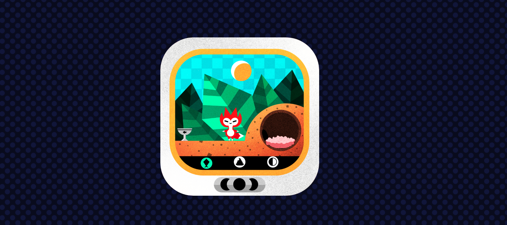

# Tamagotchi

## Introduction

This is a custom version of a Tamagotchi, the handheld virtual pet of the 90's, built following Brian Holt's [fox game workshop](https://frontendmasters.com/courses/front-end-game/) in [Frontend Masters](https://frontendmasters.com/).

## Languages

The project is developed with Javascript vanilla in a first instance and the bonus of the project is to refactor the code with other frameworks or languages.

[Here](https://custom-tamagotchi.netlify.app/) is the deployed version of the project with Javascript vanillla.
